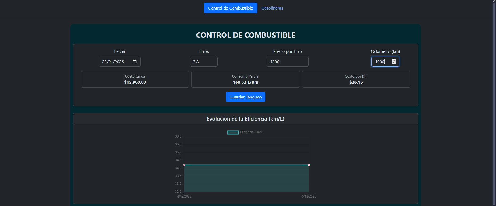
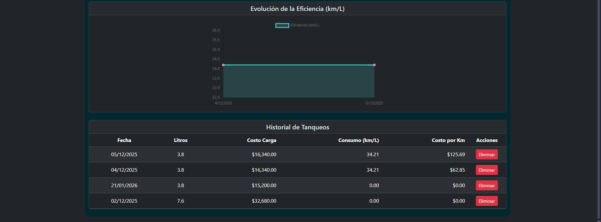
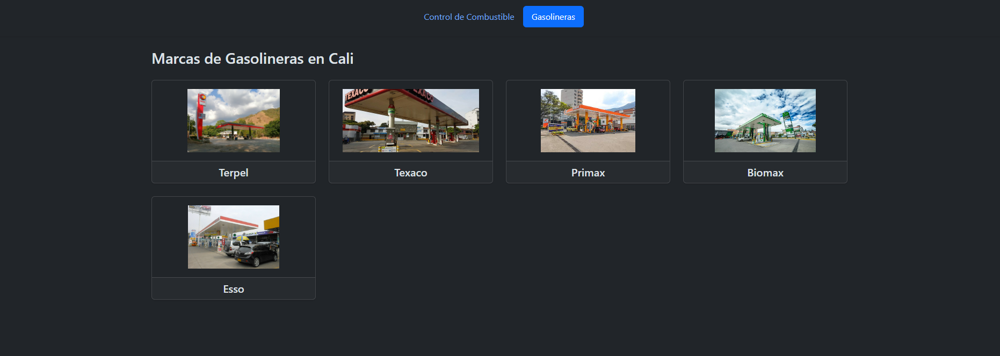

# 🚗 Control de Consumo de Combustible - Angular

Este es un proyecto desarrollado como parte de mi formación en Ingeniería de Sistemas, enfocado en el desarrollo web moderno y la gestión de datos. La aplicación permite a los usuarios llevar un control detallado de los gastos y el rendimiento de combustible de sus vehículos.

## 📋 Descripción del Proyecto

La aplicación resuelve la necesidad de monitorear la eficiencia vehicular, permitiendo registrar cada carga de combustible y calculando automáticamente métricas clave para el usuario.

Inicialmente, el proyecto exploró diferentes tecnologías de persistencia como **Google Sheets API** y **Firebase**, pero actualmente se encuentra implementado con un stack de **Angular** y **MongoDB**, demostrando flexibilidad para integrar diferentes tipos de bases de datos.

## ✨ Características Principales

- **Registro de Cargas:** Formulario para ingresar fecha, kilometraje y costo de la carga.
- **Cálculos de Rendimiento:** Algoritmos internos para determinar kilómetros recorridos entre cargas y consumo promedio por distancia.
- **Control Financiero:** Visualización clara del dinero total invertido en combustible.
- **Historial Detallado:** Tabla dinámica con el registro histórico de todas las operaciones.

## 🛠️ Tecnologías Utilizadas

- **Frontend:** [Angular](https://angular.io/) (Estructura de componentes y servicios).
- **Base de Datos:** [MongoDB](https://www.mongodb.com/) (Persistencia de datos).
- **Integraciones previas:** Firebase, Google Database.
- **Lenguaje:** TypeScript / HTML5 Semántico / CSS3.

## 🚀 Logros Técnicos

- Implementación de servicios en Angular para la gestión de datos.
- Manejo de lógica de cálculos matemáticos en el frontend para métricas en tiempo real.
- Experiencia en migración de esquemas de datos entre NoSQL (Firebase/MongoDB).

## 📸 Vista Previa

  

  

  

Desarrollado por Luis David Angel Rincon - Estudiante de Ingeniería de Sistemas (UNIAJC)
